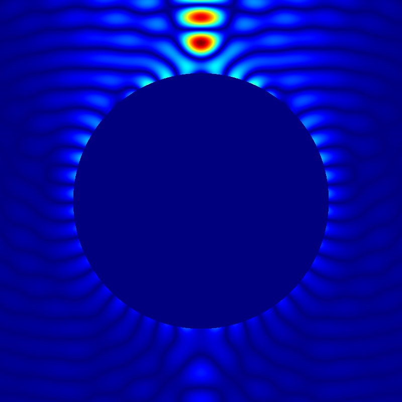
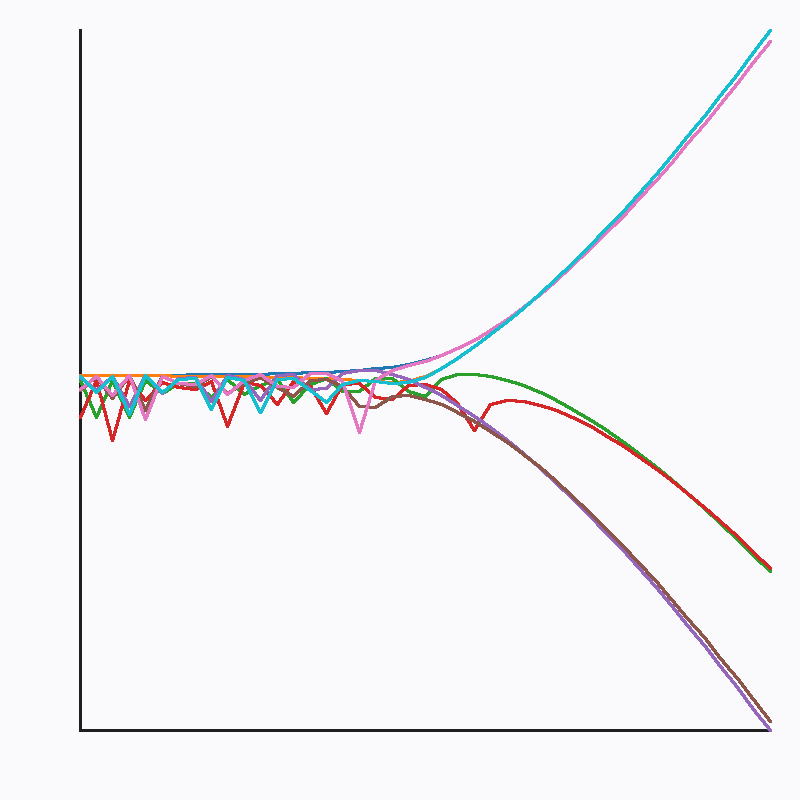

# Sage ComplexBall spherical sequences → Go Mie rendering

[](https://bids.mybinder.org/v2/gh/OutisNemosseus/sage_Bessel_sequence_Mie_scattering_binder/52e73a1205f5341c9d328aec4510830849fb7f9c?urlpath=lab/tree/01_Sage_Spherical_Sequence_API_Export.ipynb)
This repository demonstrates a proposed certified spherical Bessel/Hankel
sequence API for SageMath. Sage computes the special-function boundary data;
Go then performs the repeated radial, angular, multipole, and pixel
calculations needed to render an 800×800 Mie-scattering field.
## Results

### Mie-scattering fields

The Go stage consumes all 344 complex midpoint values exported by Sage and
computes the complete 800 × 800 field.

| Total field | Scattered field |
| --- | --- |
|  |  |

Calculation profile:

- `Lmax = 42`
- `R / lambda = 3.18`
- `n = 1.33 + 0 i`
- grid: `800 × 800`
- 48,603 cached radii for 320,000 half-plane pixels

### Sage spherical Bessel/Hankel sequences

The Sage API computes eight certified value and derivative sequences through
order 42. Go reads the exported JSON and plots `log10(|value|)`.



## Launch Binder

Use the Binder badge above, or open one of these links:

- [mybinder.org](https://mybinder.org/v2/gh/OutisNemosseus/sage_Bessel_sequence_Mie_scattering_binder/main?urlpath=lab/tree/01_Sage_Spherical_Sequence_API_Export.ipynb)
- [2i2c Binder](https://2i2c.mybinder.org/v2/gh/OutisNemosseus/sage_Bessel_sequence_Mie_scattering_binder/main?urlpath=lab/tree/01_Sage_Spherical_Sequence_API_Export.ipynb)
- [GESIS Binder](https://notebooks.gesis.org/binder/v2/gh/OutisNemosseus/sage_Bessel_sequence_Mie_scattering_binder/main?urlpath=lab/tree/01_Sage_Spherical_Sequence_API_Export.ipynb)

The first launch may take several minutes while Binder builds the image. A
successful image build includes:

```text
PATCHED SAGE API CHECK: PASS
```

Binder uses the `Dockerfile` located at the repository root. A Dockerfile in a
nested directory is not used for this launch configuration.

## Run order

Run all three notebooks in the same Binder session, in this order.

### 1. Sage export

Open `01_Sage_Spherical_Sequence_API_Export.ipynb`, select the **SageMath**
kernel, and choose **Run → Run All Cells**.

The notebook imports the proposed functions from `sage.all`, verifies that
they resolve to the patched Sage source, evaluates all eight value/derivative
sequences through order 42 with `ComplexBallField(192)`, and writes:

```text
sage-spherical-sequences-for-go.json
```

Expected final message:

```text
JSON EXPORT: PASS (344 complex midpoint pairs; 800 x 800)
```

### 2. Go sequence validation and plot

Open `02_Go_Spherical_Sequence_Render.ipynb`, select **Go (gonb)**, and run all
cells.

It reads the Sage JSON, validates eight sequences containing 344 complex
values, and writes:

```text
sage-spherical-sequences-go-render.png
```

Expected final message:

```text
GO JSON VALIDATION AND RENDER: PASS
```

### 3. Go Mie field calculation

Open `03_Go_Mie_Scattering_From_Sage_JSON.ipynb`, select **Go (gonb)**, and run
all cells.

It consumes the same 344 Sage values, constructs the Mie coefficients, builds
a cache of unique radii, evaluates the Legendre sequences and multipole sums,
and writes the total and scattered fields.

Expected final message:

```text
SAGE API JSON / GO MIE RENDER: PASS
```

## Viewing the generated images

The Go notebooks intentionally use only the Go standard library for image
generation. They do **not** import `github.com/janpfeifer/gonb/gonbui`.

After a notebook finishes, refresh the JupyterLab file browser and open the PNG
file there. To show the two Mie images inside the third notebook, add or
re-execute a Markdown cell containing:

```markdown
## Total Mie field


## Scattered Mie field


```

## Fixed calculation profile

The demonstration uses one fixed profile throughout:

- grid: 800 × 800;
- maximum spherical order: 42;
- wavelength: 0.2;
- sphere radius: 3.18 wavelengths;
- refractive index: 1.33 + 0 i;
- relative permeability: 1;
- Sage ball precision: 192 bits.

## Data flow

```text
Patched Sage public API
    ↓
Certified ComplexBall spherical Bessel/Hankel values and derivatives
    ↓
Ball midpoints exported as float64 real/imaginary JSON pairs
    ↓
Go Mie coefficients and radial cache
    ↓
Go Legendre sequences and multipole summation
    ↓
Binary field data and PNG images
```

Sage performs the numerically sensitive special-function boundary calculation
with certified Arb balls. The JSON transport intentionally exports their
midpoints as double-precision pairs because the downstream Go renderer uses
`float64` arithmetic.

## Sage PR provenance

The proposed Sage implementation is commit:

```text
dda09a7229a39589ef50dedcabd1c40de9d4f856
```

on branch:

```text
OutisNemosseus:spherical-bessel-sequences
```

The Sage 10.9 Binder base image predates the proposed API. During the Binder
image build, the root `Dockerfile` applies the complete two-file PR patch to:

```text
/home/sage/sage/src/sage/functions/all.py
/home/sage/sage/src/sage/functions/bessel.py
```

It then links the active Sage modules to those patched files and verifies that
these three public functions import from the modified `bessel.py`:

```text
spherical_bessel_J_sequence
spherical_bessel_Y_sequence
spherical_hankel1_sequence
```

The build fails if the patch cannot be applied, an API cannot be imported, or
the resolved source path is wrong. The notebooks contain no fallback
implementation of these three functions.

## Validation evidence

The patched Sage source was independently compared with a 50-digit Mathematica
reference for:

- `JX` and its derivative;
- `JMX` and its derivative;
- `YX` and its derivative;
- `HX` and its derivative;
- every order from 0 through 42.

All 344 complex values passed. The largest scaled midpoint difference was
`1.273578257250780e-16`, for `YX` at order 26.

This external Mathematica notebook and its reference JSON are validation
evidence only; they are not required by Binder and are not used by the Sage
doctests.

## Binder environment

The Binder image supplies both required kernels:

- **SageMath**, from the Sage 10.9 Binder image;
- **Go (gonb)**, installed during the Docker build.

The Go environment uses Go 1.22.12 and GoNB 0.9.6. The Go notebooks therefore
avoid importing `gonbui`: automatically fetching the latest GoNB module may
select a version that requires a newer Go compiler.

No local SageMath, Go, Mathematica, or GoNB installation is required.

## Generated files

The notebooks create:

```text
sage-spherical-sequences-for-go.json
sage-spherical-sequences-go-render.png
sage-api-go-mie-total.data
sage-api-go-mie-scattered.data
sage-api-go-mie-total.png
sage-api-go-mie-scattered.png
```

The `.data` files contain row-major, little-endian `float64` values.

Binder sessions and their generated files are temporary. Download any JSON,
`.data`, PNG, or executed notebook that you want to keep before closing the
session.

## Troubleshooting

### Go tries to download GoNB v0.11.5

If execution reports that GoNB v0.11.5 requires Go 1.24.4, the notebook is an
older copy that still contains `gonbui`. Search the entire notebook for both
`gonbui` and `janpfeifer`; both searches must return zero matches. Restart the
Go kernel after removing all such references.

### A PNG is not displayed inline

Refresh the JupyterLab file browser and open the generated PNG directly, or
re-execute the Markdown image cell shown above. PNG generation is complete
when the notebook prints its `PASS` message.

### `Invalid response: 424` while saving

This concerns communication with the temporary Binder session, not a completed
Go calculation. Download generated files immediately. If uploads and file
operations also fail, start a new Binder session from the latest repository
commit.

### Binder uses an older notebook

Commit the corrected notebooks to the repository's `main` branch and launch
Binder again. Binder images and sessions are keyed by Git commit, so a new
commit forces Binder to use the updated repository contents.
